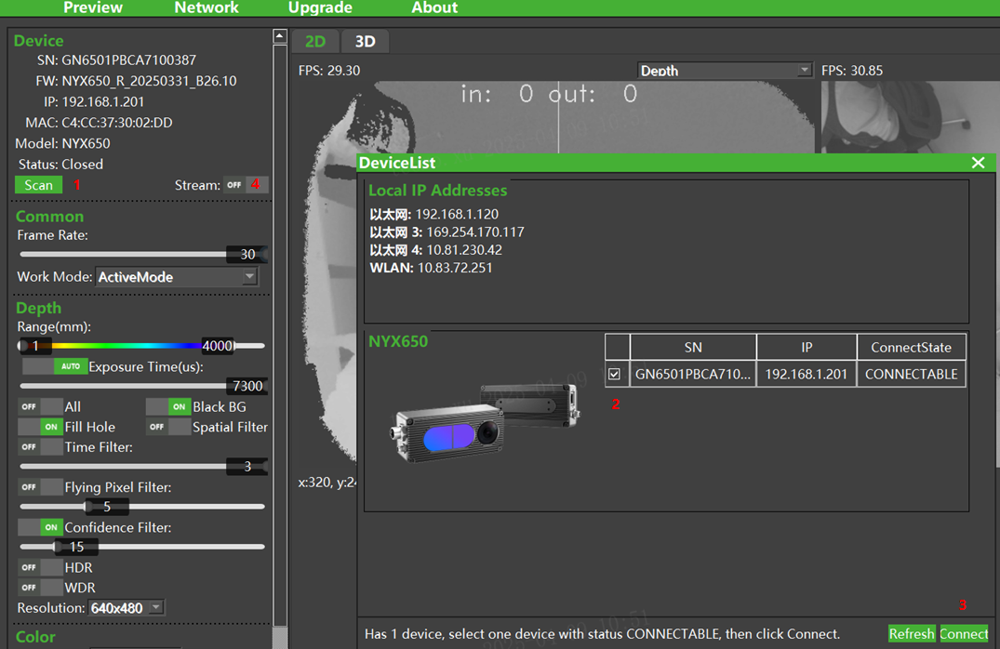
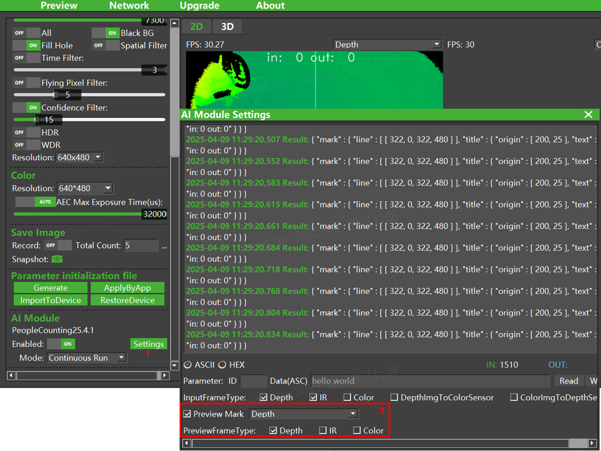
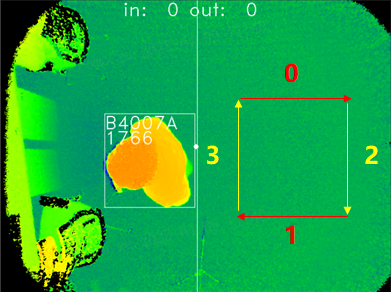
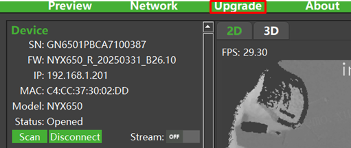

## People Counting Algorithm

[中文](README.zh-CN.md)

This algorithm implements human detection and tracking. By setting the predefined "line" (the detection line), it counts the number of people crossing the line, making it widely applicable for passenger flow statistics in various indoor and outdoor scenarios.

### Supported Products

- NYX Camera
  - NYX650 (NYX650_R_20241203_B26  and later )

### Camera Installation Diagram

Installation Requirements:

- Ensure the camera’s front cover is as parallel as possible to the ground (angle less than 5 degrees).
- Ensure no obstructions around the camera.
- Camera installation height range: 1800~2900 mm.

### Algorithm Counting Logic

A person is counted only if the following conditions are met:

- The person is detected by the algorithm.
- The person’s movement trajectory crosses the detection line.
- The person exits the camera’s field of view.

When the movement direction matches the InDirection, the IN count increases by 1.
When the movement direction is opposite to InDirection, the OUT count increases by 1.

### Viewing Algorithm Results with ScepterUtool

1. Launch the [ScepterUtool](https://sourceforge.net/projects/scepterguitool/files/TMP/) , open the camera, and start streaming.
   
   

1. Click the 【Settings】 button in the AI Module section to configure preview parameters.
   
   

1. After setup, view the algorithm results on the depth map.
   
   

### Viewing Algorithm Results with Sample Code

1. Open the file Windows/Sample/Sample.vcxproj in Visual Studio.

2. Set the compilation option to Release and x64.

3. Compile the project. The output file is located in the Bin/x64 directory.

4. Run Windows/Sample/Bin/x64/Sample.exe to view the algorithm results.

5. Alternatively, use the precompiled sample at: Windows\PrecompiledSample\Sample.exe.

   

### Algorithm Parameter Configuration

Use ScepterUtool to modify the algorithm’s configuration parameters as shown below.

| Parameter        | Description                                                  |
| ---------------- | ------------------------------------------------------------ |
| Camera_Height    | Set the height of the camera’s front cover from the ground (range: 1800–2900 mm). |
| InDirection      | Set the entry direction (values: 0, 1, 2, 3). Refer to the diagram below for details.  |
| Other Parameters | Not recommended for modification.                            |

### Algorithm Upgrade Method

1. Download the Algorithm

   Download link: https://github.com/ScepterSW/ScepterAlgorithmLib/AI-Camera/PeopleCounting/AI_Module.

2. Upgrade the Algorithm

   a. Launch ScepterUtool and open the camera.

   

   b. Click the 【Upgrade】 tab to switch to the upgrade page.

   

   c. Select the algorithm file downloaded in Step 1.

   

   d. Click the 【Upgrade】 button to start the upgrade. After completion, a prompt to restart the camera will appear. Click 【Yes】 to finish.

   

### FAQ

Q1: How to reset the count?

In ScepterUtool: Toggle the Enable option in the AI Module (set to OFF first, then ON).
In Sample.exe: Use the hotkeys “C” or “c” to reset the count.
