## 客流统计算法

[English](README.md)

本算法实现人体的识别和跟踪。算法通过设置预定义“线”(检测线)，统计穿越线的人数，可以广泛的应用于室内外多种场景的客流统计。

### 支持的产品

- NYX Camera
  - NYX650 （NYX650_R_20250331_B26.12及以上）

### 相机安装示意图

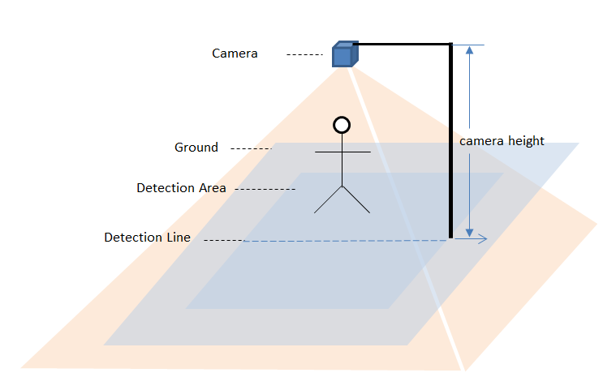

安装要求：

- 确保相机前盖板与地面尽量平行（夹角小于5度）；

- 确保相机周围没有干扰物；

- 相机安装高度范围1800~2900mm；

### 算法计数说明

人体满足以下条件才会被计数：

- 人体被算法检测到；

- 人体的移动轨迹跨越了检测线；

当人体移动方向与InDirection一致时，IN计数加1；

当人体移动方向与InDirection相反时，OUT计数加1；

### 使用ScepterUtool查看算法结果

1. 启动软件[ScepterUtool](https://sourceforge.net/projects/scepterguitool/files/TMP/)，打开相机，并开流。

   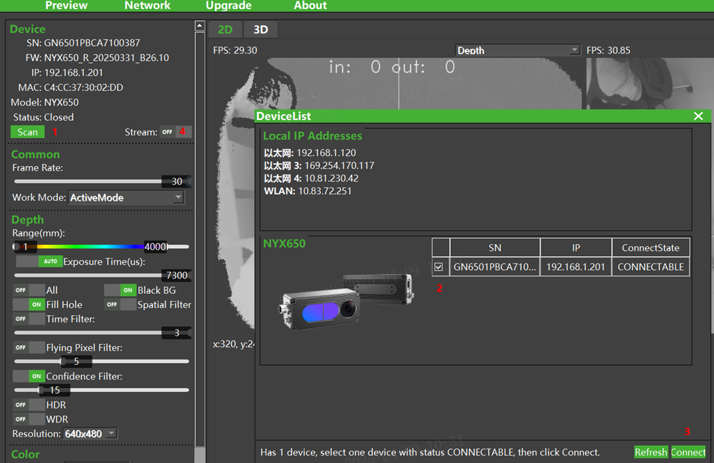

2. 点击AI Module区域的【Settings】按钮，设置预览参数。

   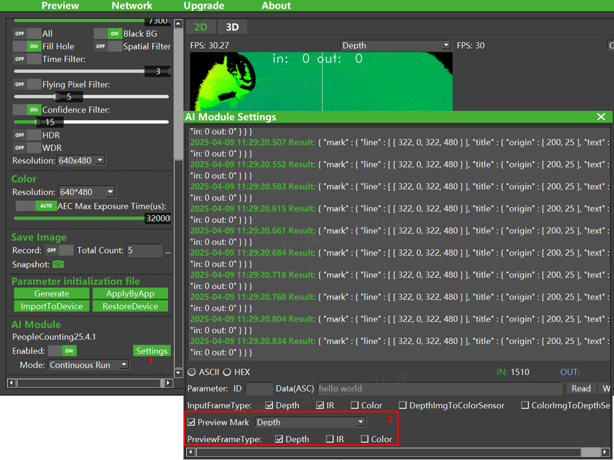

3. 设置完成后，可以在深度图上查看算法的结果。

   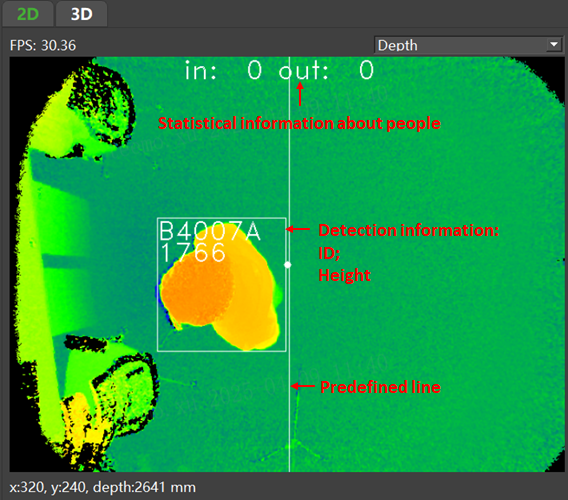

   

### 使用示例代码查看算法结果

1. 使用 Visual Studio 打开Windows/Sample/Sample.vcxproj文件;

2. 将编译选项设置为 **Release** 和 **x64**;

3. 执行编译，生成文件位于 Bin/x64 目录;

4. 运行Windows/Sample/Bin/x64/Sample.exe可以查看算法结果。

5. 也可以直接使用编译好的Sample测试，路径：Windows\PrecompiledSample\Sample.exe。

   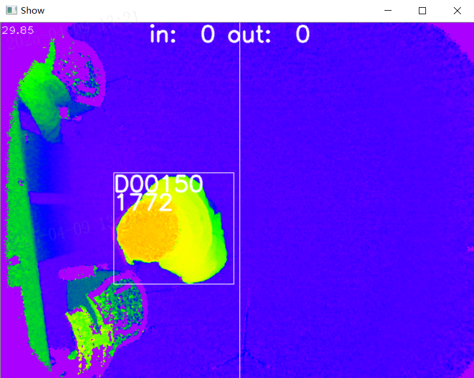

### 算法结果说明及解析示例代码

算法结果是JSON格式的字符串，具体格式可参考下面示例。
```json
{
  "mark": {
    "label": [
      {"origin": [124, 473], "text": "95002D"},
      {"origin": [124, 498], "text": "1298"}    ],
    "line": [
      [337, 0, 337, 480],
      [124, 448, 280, 448],
      [280, 448, 280, 514],
      [280, 514, 124, 514],
      [124, 514, 124, 448] ],
    "title": { "origin": [200, 25], "text": "in: 4 out: 3"}  },
  "peopleInfo": [
    {"height": 1298, "id": "95002D", "posInWorld": [600, 743, 1402]}  ],
  "statistics": {"in": 4,"out": 3}
}
```


JSON字符串中的元素说明如下：

|    元素    | 说明                                                         |
| :--------: | ------------------------------------------------------------ |
|    mark    | 用于ScepterUtool/PrecompiledSample等工具演示算法检测效果。   |
| peopleInfo | 用于保存算法检测到人员信息：包括标识（id）、身高（height）、三维坐标（posInWorld）。 |
| statistics | 用于保存算法统计到的人员进出数目：包括进入人数（in）、离开人数（out）。 |

解析示例代码

```c++
struct PeopleInfo
{
    uint64_t id;
    uint32_t height;
    cv::Point3i posInWorld;
};

uint64_t hexStringToUInt64(const std::string& hexStr) {
    return std::stoull(hexStr, nullptr, 16);
}

//解析 peopleInfo
Json::Value peopleInfoJson = root["peopleInfo"];
if (peopleInfoJson.size() > 0)
{
    vector<PeopleInfo> peopleInfoVec(peopleInfoJson.size());
    for (auto i = 0; i < peopleInfoJson.size(); i++)
    {
        const Json::Value singleJson = peopleInfoJson[i];
        peopleInfoVec[i].id = hexStringToUInt64(singleJson["id"].asString());
        peopleInfoVec[i].height = singleJson["height"].asUInt();
        const Json::Value& pos = singleJson["posInWorld"];
        peopleInfoVec[i].posInWorld = cv::Point3i(pos[0].asInt(), pos[1].asInt(), pos[2].asInt());
    }
}

//解析 statistics
Json::Value statisticsJson = root["statistics"];
uint32_t in_statistics = statisticsJson["in"].asUInt();
uint32_t out_statistics = statisticsJson["out"].asUInt();
```

### 算法参数配置

使用ScepterUtool可以修改算法的配置参数，具体操作如下图。

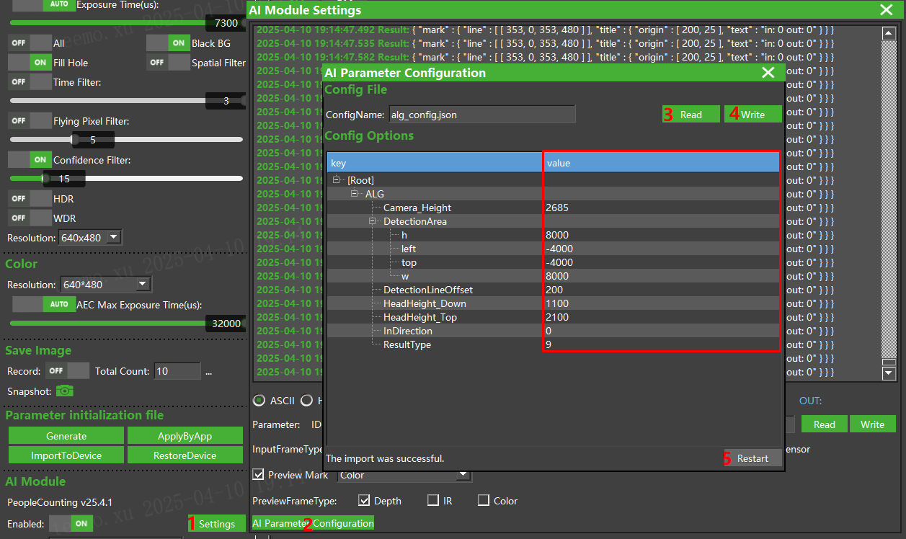

| 参数项                 | 说明                                                         |
| ---------------------- | ------------------------------------------------------------ |
| Camera_Height          | 设置相机前盖板离地面的高度，取值范围1800~2900mm。            |
| InDirection            | 设置进入方向，取值范围：0、1、2、3，具体含义可以参考下图。<br>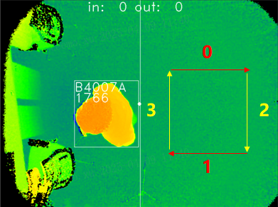 |
| DetectionLine          | 设置检测线位置，详细参见备注。                               |
| DetectionLineThreshold | 设置检测线阈值，详细参见备注。                               |
| ResultType             | 设置算法上报结果类型，可配置数值及含义如下：<br />1: peopleInfo<br />8: statistics<br />16: mark<br />每个数值与【算法结果说明及解析示例代码】中JSON字符串中的元素说明一一对应。<br />上述不同数值可以联合使用。 |
| 其它参数               | 不建议修改。                                                 |

备注：

参数InDirection、DetectionLine、DetectionLineThreshold之间的关系参见下图。

当人跨过In/Out Trigger Line，且满足计数条件时，In/Out才计数。
| 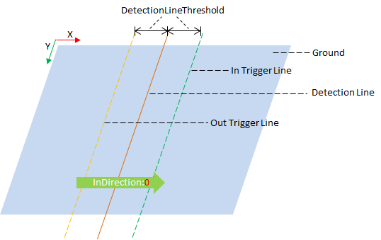 | 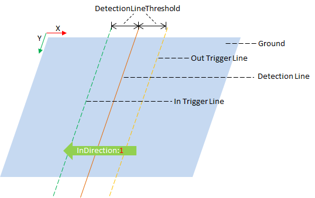 |
| ------------------------------------------ | ------------------------------------------ |
| 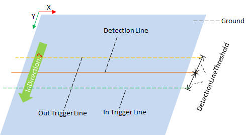 | 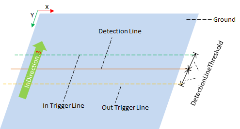 |
### 算法升级方法

1. **下载算法**

   下载地址： https://github.com/ScepterSW/ScepterAlgorithmLib/tree/main/AI-Camera/PeopleCounting/AI_Module

2. **算法升级**

   a. 启动软件ScepterUtool，打开相机；

   

   b. 点击【Upgrade】标签，切换到升级页面；

   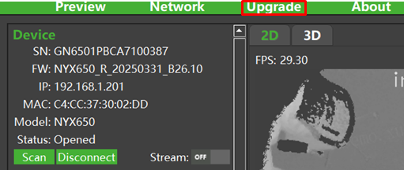

   c. 选择步骤1中下载的算法文件；

   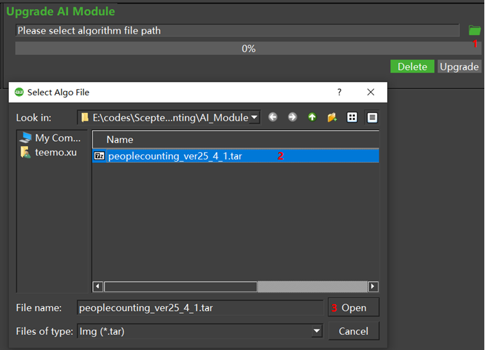

   d.点击【Upgrade】按钮，开始升级算法。算法升级完成后，会提示相机重启，点击【Yes】按钮，升级完成。

   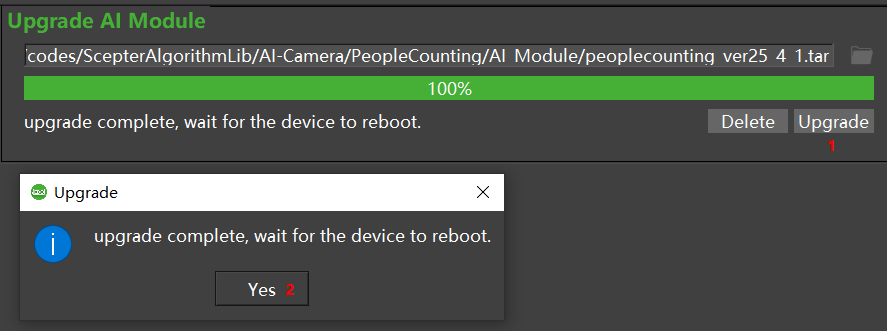

### 常见问题

**问题1：** 如何重置计数？

- 当使用ScepterUtool时，可以通过AI Module的Enable项重置计数，具体操作：先设置为OFF，再设置为ON；
- 当使用Sample.exe时，可以通过热键“C”或“c”重置计数。
