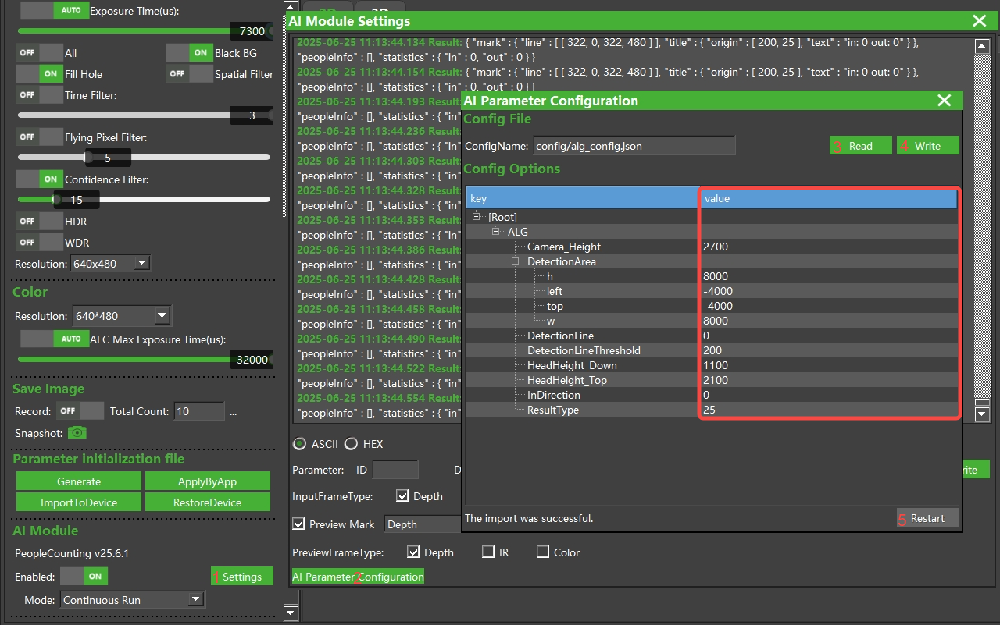

## 客流统计算法

[English](README.md)

本算法实现人体的识别和跟踪。算法通过设置预定义“线”(检测线)，统计穿越线的人数，可以广泛的应用于室内外多种场景的客流统计。

### 支持的产品

- NYX Camera
  - NYX650 （NYX650_R_20250331_B26.12及以上）

### 相机安装示意图

安装要求：

- 确保相机前盖板与地面尽量平行（夹角小于5度）；

- 确保相机周围没有干扰物；

- 相机安装高度范围1800~2900mm；

### 算法计数说明

人体满足以下条件才会被计数：

- 人体被算法检测到；

- 人体的移动轨迹跨越了检测线；

- 人体走出相机视野；

当人体移动方向与InDirection一致时，IN计数加1；

当人体移动方向与InDirection相反时，OUT计数加1；

### 使用ScepterUtool查看算法结果

1. 启动软件[ScepterUtool](https://sourceforge.net/projects/scepterguitool/files/TMP/)，打开相机，并开流。

   

2. 点击AI Module区域的【Settings】按钮，设置预览参数。

   

3. 设置完成后，可以在深度图上查看算法的结果。

   

   

### 使用示例代码查看算法结果

1. 使用 Visual Studio 打开Windows/Sample/Sample.vcxproj文件;

2. 将编译选项设置为 **Release** 和 **x64**;

3. 执行编译，生成文件位于 Bin/x64 目录;

4. 运行Windows/Sample/Bin/x64/Sample.exe可以查看算法结果。

5. 也可以直接使用编译好的Sample测试，路径：Windows\PrecompiledSample\Sample.exe。

   

### 算法参数配置

使用ScepterUtool可以修改算法的配置参数，具体操作如下图。

| 参数项        | 说明                                                         |
| ------------- | ------------------------------------------------------------ |
| Camera_Height | 设置相机前盖板离地面的高度，取值范围1800~2900mm。            |
| InDirection   | 设置进入方向，取值范围：0、1、2、3，具体含义可以参考下图。  |
| 其它参数      | 不建议修改。                                                 |

### 算法升级方法

1. **下载算法**

   下载地址： https://github.com/ScepterSW/ScepterAlgorithmLib/AI-Camera/PeopleCounting/AI_Module

2. **算法升级**

   a. 启动软件ScepterUtool，打开相机；

   

   b. 点击【Upgrade】标签，切换到升级页面；

   

   c. 选择步骤1中下载的算法文件；

   

   d.点击【Upgrade】按钮，开始升级算法。算法升级完成后，会提示相机重启，点击【Yes】按钮，升级完成。

   

### 常见问题

**问题1：** 如何重置计数？

- 当使用ScepterUtool时，可以通过AI Module的Enable项重置计数，具体操作：先设置为OFF，再设置为ON；
- 当使用Sample.exe时，可以通过热键“C”或“c”重置计数。
