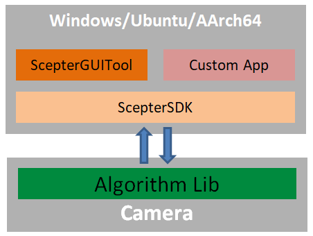

## Edge Computing Version Algorithm Library

[中文](README.zh-CN.md)

This directory contains the edge computing implementation of Vzense's core algorithms, built on the MorphAISDK with an embedded optimized architecture design, enabling low-latency intelligent processing directly on the camera. 

### Supported Products

- NYX Camera
  - NYX650:  (NYX650_R_20250331_B26.12and later )

### Software architecture

As shown in the diagram above, the algorithms are deployed on the camera platform.

**Module Functions:**

- **Algorithm Lib:** Algorithm library integrated into the camera, providing algorithm functionalities. Developers can update or replace the algorithm library to test the effects of different algorithms.

- **ScepterSDK:** A cross-platform software development kit offering APIs for camera control, algorithm configuration, image acquisition, and result retrieval, facilitating secondary development.

- **ScepterGUITool:** A visual debugging GUI tool (optional) equipped with real-time parameter adjustment panels and algorithm result preview interfaces, simplifying development and debugging.

- **Custom App:** Custom applications developed by integrating Scepter SDK APIs to meet specific business scenarios.

Developers can use ScepterGUITool for algorithm validation and performance benchmarking, then leverage Scepter SDK APIs to rapidly develop custom applications, accelerating business deployment.

### Advantages

- Algorithms are embedded in the camera, offering high system integration and eliminating the need for additional industrial PCs, reducing overall BOM costs.
- Algorithms run locally on the camera, allowing developers to focus on application development without worrying about algorithm runtime environments and details, significantly lowering development costs.

### Algorithm List

| Name                                                  | Description                                                  |
| ----------------------------------------------------- | ------------------------------------------------------------ |
| [People Counting Algorithm](PeopleCounting/README.md) |   The algorithm achieves human detection and tracking while performing people counting based on predefined detection lines. |
