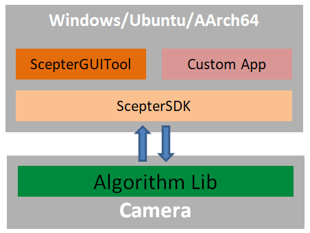

## 边缘计算版算法库

[English](README.md)

本目录为Vzense核心算法的边缘计算实现方案，基于MorphAISDK构建，采用嵌入式优化架构设计，支持在相机端实现低延迟智能处理。

### 支持的产品

- NYX Camera
  - NYX650：待定
- Vzense Camera
  - DS86：待定

### **软件架构**

如上图所示，算法部署于相机平台。

模块功能如下：

- **Algorithm Lib**：集成在相机端的算法库，实现算法功能。开发者可以更新替换算法库，测试不同算法的效果；
- **ScepterSDK**：跨平台的软件开发套件，提供相机控制、算法设置，获取图像，获取算法结果的API，方便开发者进行二次开发；
- **ScepterGUITool**：可视化调试图形界面工具（非必须），配备参数实时调整面板、算法结果预览界面，便于开发者开发调试。
- **Custom App**：开发者调用Scepter SDK API，结合业务场景开发的自定义应用。

开发者可以使用ScepterGUITool，完成算法验证与性能基准测试，然后通过调用Scepter SDK API实现自有应用的快速开发，使业务场景迅速落地。

**优势**

- 算法内置在相机，系统集成度高，无需额外配置工控机，降低方案整体的BOM成本
- 算法在相机本地运算，让开发者无需要关心算法运行环境和细节，更加专注于自有应用的开发，显著降低开发成本

### 算法列表

待发布

