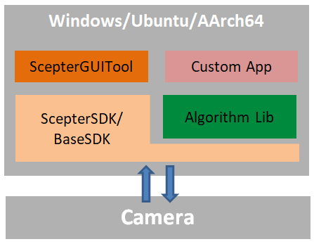

## Computer Version Algorithm Library

[中文](README.zh-CN.md)

This directory contains the host computer implementation of Vzense's core algorithms, built on the ScepterSDK with a modular architecture design that supports cross-platform deployment.

### Supported Platforms

- Arm-Linux (AArch64 architecture)
- Ubuntu (x86_64 architecture)
- Windows 10/11 (x86_64 architecture)

### Software architecture

As shown in the diagram above, the algorithms are deployed on the host computer.

Module Functions:

- **Camera**: RGB-D cameras released by Vzense. Different algorithms require specific camera models. Users should select appropriate camera products based on the algorithm requirements (refer to specific algorithm documentation).

- **ScepterSDK**: A cross-platform software development kit providing APIs for camera control and image acquisition, enabling efficient secondary development.

- **Algorithm Lib**: Algorithm library deployed on the host computer, offering functionalities such as parameter configuration and result retrieval through APIs.

- **Precompiled Tool**: Pre-built tools for algorithm demonstration, facilitating testing and performance evaluation.

- **Custom App**: Custom applications developed by integrating ScepterSDK and Algorithm Lib APIs to meet specific business scenarios.
  Developers can use precompiled tools in the algorithm library for validation and benchmarking, then leverage ScepterSDK and Algorithm Lib APIs to rapidly develop customized applications, accelerating business deployment.

### Advantages

- Maximizes host computer performance for enhanced algorithm effectiveness.
- Flexible scalability for multi-camera connectivity.
- Streamlined development with real-time debugging and image preview.

### Algorithm List

| Name                                                        | Description                                                  |
| ----------------------------------------------------------- | ------------------------------------------------------------ |
| [3D Volume Measurement Algorithm](VolumeMeasure/Readme.md)) |  Measures the length, width, and height of cartons. |
