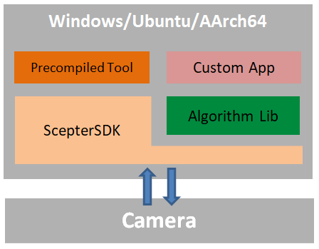

## 计算机版算法库

[English](README.md)

本目录为Vzense核心算法的主控计算机实现方案，基于ScepterSDK构建，采用模块化架构设计，支持跨平台部署。

### 支持的平台

- Arm-Linux （AArch64 架构）
- Ubuntu （x86_64 架构）
- Windows 10/11（x86_64 架构）

### 软件架构

如上图所示，算法部署在主控计算机。

模块功能如下：

- **Camera**：Vzense发布的RGBD相机。不同的算法对相机的需求不同，用户需要根据使用的算法，挑选合适的相机产品，可以参见具体的算法介绍页。
- **ScepterSDK**：跨平台的软件开发套件，提供相机控制、获取图像的API，方便开发者进行二次开发时，对相机进行控制；
- **Algorithm Lib**：部署在主控计算机的算法库，实现算法功能，提供参数配置、获取结果的API，方便开发者进行二次开发时，对算法进行控制；
- **Precompiled Tool**：展示算法功能的工具，便于开发者进行算法的测试和评估。
- **Custom App**：开发者调用ScepterSDK 和 Algorithm Lib的API，结合业务场景开发的自定义应用。

开发者可以使用算法库中的预编译工具，完成算法验证与性能基准测试，然后通过调用ScepterSDK 和Algorithm Lib的API实现自有应用的快速开发，使业务场景迅速落地。

**优势**

- 充分利用上位机的性能，实现更好的算法效果

- 灵活扩展，方便多相机互联

- 开发便捷，可实时调试和预览图像

### 算法列表

| 名称                                              | 描述                                                         |
| ------------------------------------------------- | ------------------------------------------------------------ |
| [三维体积测量算法](VolumeMeasure/README.zh-CN.md) |   测量纸箱的长、宽、高。 |
