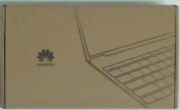
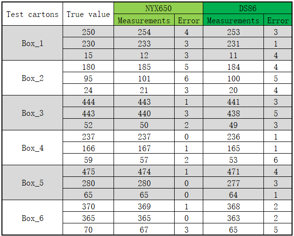

## Measurement data

### Installation diagram of the camera

precautions：

- The front panel of the camera should be parallel to the test plane.
- There should be no obstructing objects around the camera.
- There should be no obstructing objects on the test plane. If there are, please use low-reflectivity materials to cover the obstructive objects.

### Test cartons

|    Name    |           Box_1            |           Box_2            |           Box_3            |           Box_4            |           Box_5            |           Box_6            |
| :--------: | :------------------------: | :------------------------: | :------------------------: | :------------------------: | :------------------------: | :------------------------: |
| Length(mm) |            250             |            180             |            444             |            237             |            475             |            370             |
| Width(mm)  |            230             |             95             |            443             |            166             |            280             |            365             |
| Height(mm) |             15             |             24             |             52             |             59             |             65             |             70             |
|   Image    |  |  |  |  |  |  |

note: sort by the height of the cartons

### Measurement results

