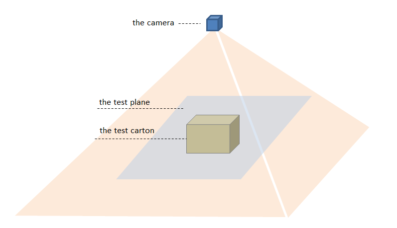
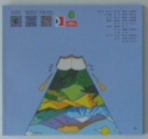
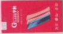
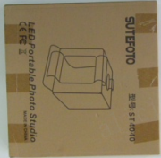
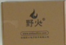
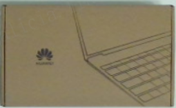
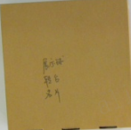
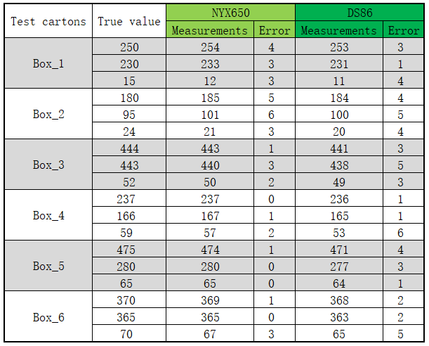
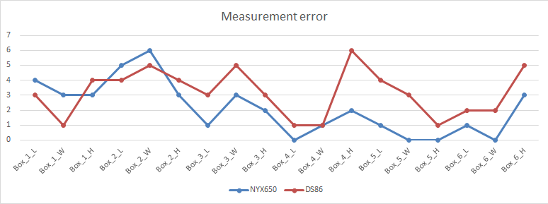

## Measurement data

[中文](Measurement_data.zh-CN.md)

### Installation diagram of the camera

Environmental Configuration Requirements:

- Ensure the camera front cover is as parallel as possible to the measurement plane (angle < 3°) .
- Remove all interfering objects around the camera.
- Eliminate interfering objects near the measured object. If unavoidable, use low-reflectivity materials for shielding.

### Test cartons's Specifications

|   Box ID   |           Box_1            |           Box_2            |           Box_3            |           Box_4            |           Box_5            |           Box_6            |
| :--------: | :------------------------: | :------------------------: | :------------------------: | :------------------------: | :------------------------: | :------------------------: |
| Length(mm) |            250             |            180             |            444             |            237             |            475             |            370             |
| Width(mm)  |            230             |             95             |            443             |            166             |            280             |            365             |
| Height(mm) |             15             |             24             |             52             |             59             |             65             |             70             |
|   Image    |  |  |  |  |  |  |

Note: Sorted by box height from smallest to largest; The camera mounting height is 1040 mm.

### Measurement results

