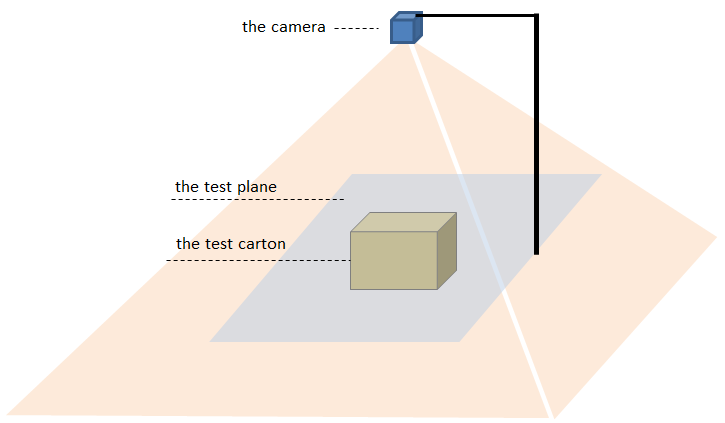
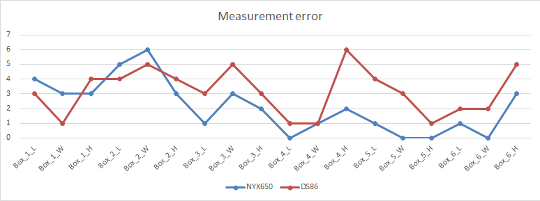

## 测试数据

[English](Measurement_data.md)

### 测试环境安装示意图

环境配置要求：

- 确保相机前盖板与测试平面尽量平行（夹角小于3度）；
- 确保相机周围没有干扰物；
- 确保被测物体周围没有干扰物。如果有，请使用低反射率的材料进行遮蔽。

### 测试盒子的规格

| 盒子编号 |           Box_1            |           Box_2            |           Box_3            |           Box_4            |           Box_5            |           Box_6            |
| :------: | :------------------------: | :------------------------: | :------------------------: | :------------------------: | :------------------------: | :------------------------: |
|  长(mm)  |            250             |            180             |            444             |            237             |            475             |            370             |
|  宽(mm)  |            230             |             95             |            443             |            166             |            280             |            365             |
|  高(mm)  |             15             |             24             |             52             |             59             |             65             |             70             |
|   图片   |  |  |  |  |  |  |

备注：按照盒子的高度从小到大排序。

### 测试结果

