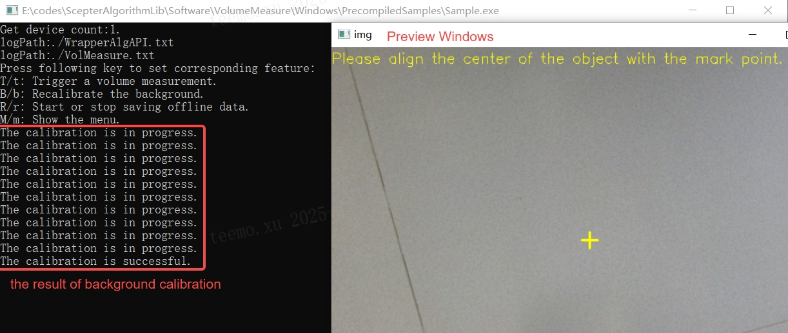
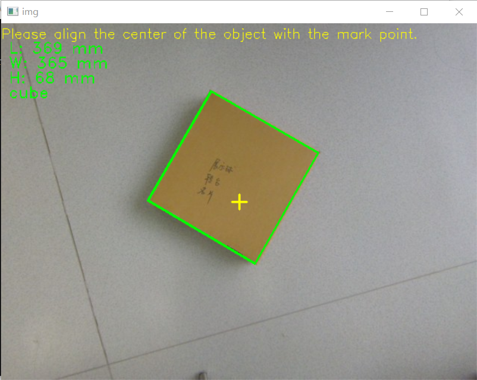

## 3D Volume Measurement Algorithm

[中文](README.zh-CN.md)

This algorithm enables precise measurement of length, width, and height for carton-like objects based on a planar reference.

### Supported Devices

- NYX Camera
  - NYX650 (NYX650_R_20241203_B26  and later )
- Vzense Camera
  - DS86 (DS86_R_20241206_B21 and later )
### Supported platforms
- Arm-Linux (AArch64 architecture): Pending
- Ubuntu (x86_64 architecture): Pending
- Windows 10/11 (x86_64 architecture): Supported


### Precompiled Sample Usage

1. **Device Installation**
   a. Mount the camera front cover as parallel as possible to the measurement plane (angle < 3°).
   b. Use a level gauge to verify installation flatness.

2. **Background Calibration**

   a. Navigate to: Software/VolumeMeasure/Windows/PrecompiledSamples/
   b. Double-click Sample.exe
   c. Press B/b to execute background calibration.

   

3. **Measurement Operation**

   a. Place the target object at the center of the measurement plane after successful calibration.
   b. Press T/t to trigger a single measurement.
   c. View real-time results in the preview window.

   

4. **Configuration File Usage**

   The default algorithm supports only cuboid-shaped objects. To measure irregular shapes, modify alg_volmeasure.json and restart Sample.exe.

   Example Configuration:

   ```json
   {
   	"ALG" : 
   	{
   		"groundPlaneParams" : 
   		[
   			0.012808113358914852,
   			0.003450226504355669,
   			0.99991202354431152,
   			-1015.4520874023438
   		],
   		"shapeType":2
   	}
   }
   ```

   Configuration Parameters:

   | Parameter         | Description                                                  |
   | ----------------- | ------------------------------------------------------------ |
   | groundPlaneParams | Background calibration parameters (auto-generated; do not edit manually). |
   | shapeType         | Object shape mode:<br />1: Cuboid only (default);<br/>2: Irregular shapes only;<br/>3: Auto-detect (Note: Shape recognition may introduce errors. If the object is confirmed to be cuboid, it is recommended to prioritize setting the mode to 1). |

### Sample Code Compilation Guide

1. Open Sample/Sample.vcxproj in Visual Studio;
2. Set build configuration to **Release** and **x64**;
3. Compile; output files are located in Bin/x64;

### FAQ

**Q1:** Background calibration fails with error: "The calibration has failed: x".

**Solution:**

1. Verify camera installation flatness.

2. Check for obstructions in the measurement area.

3. Submit the following files to technical support:

   - bg.bin

   - VolMeasure.txt

   - WrapperAlgAPI.txt

   - alg_volmeasure.json

**Q2:** How to save offline data using Sample.exe?

**Steps:**

1. Press R/r to enable offline saving (automatically creates a directory).
2. Press T/t to capture data (each press saves one file).
3. Press R/r again to stop saving. Locate the folder RECYYYYMMDD_HHMMSS_MS  for offline data.
3. Submit the entire folder to technical support.

### Measured Data Referenceesources

- Measurement data for cartons of varying sizes using different cameras:[measurement data](Measurement_data.md)
