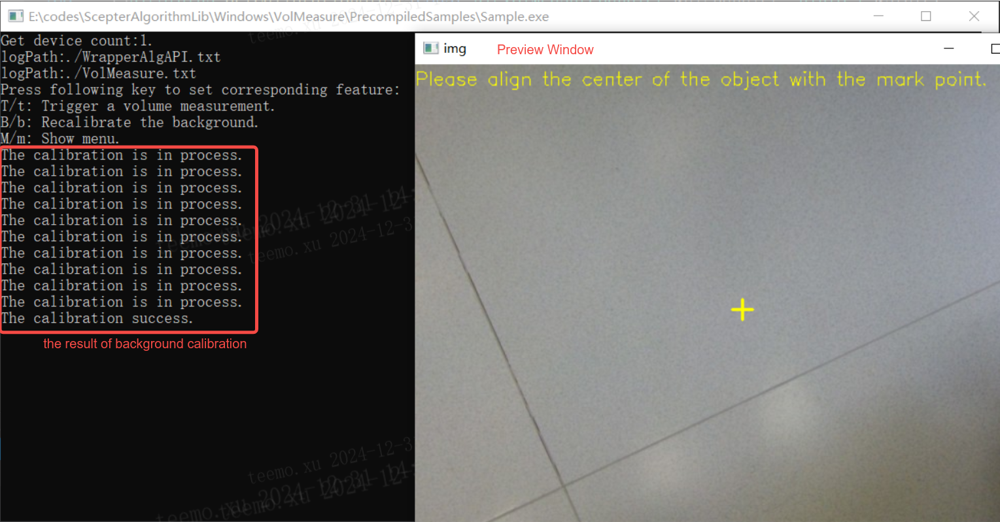

1. Set up the camera, ensuring that the camera’s front panel is parallel to the test platform.

2. Double-click to start VolMeasure/Sample.exe, and press B/b to perform background calibration.

   

3. After the background calibration is successful, place the object to be measured on the test platform, and try to position the object in the center of the image as much as possible.

4. Press T/t to perform the measurement of the target size.

5. In the image preview window, check the results of the size measurement.